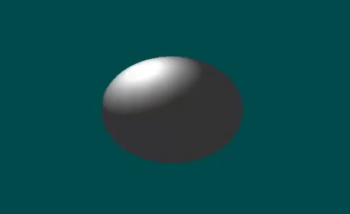
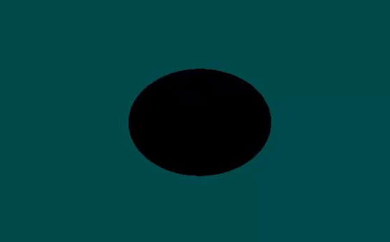
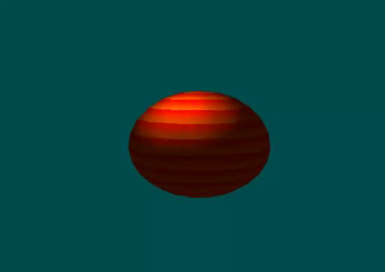
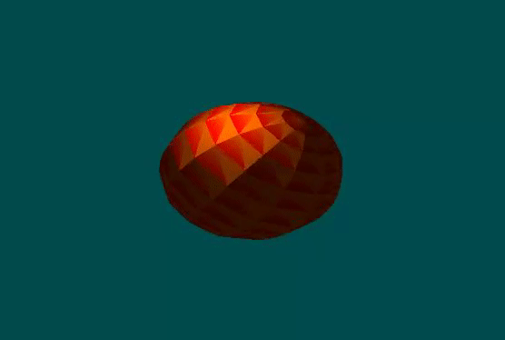

# Phong Shading Project

## Introduction
This project was created as a learning experience for working with OpenGL, C++, and concepts such as Phong Shading on a sphere. It aims to deepen understanding of geometry, vector math, and C++ programming.

# Features
- Implementation of Phong Shading on a sphere
- Utilizes OpenGL for rendering
- Written in C++

## Getting Started
To download and run the project:

1. Clone the repository to your local machine:
    ```bash
    git clone https://github.com/yourusername/phong-shading-project.git
    ```

2. Open the solution file in your preferred IDE or text editor.
3. Ensure that any required dependencies are installed.
4. Build and run the project.

## Dependencies
Ensure the following dependencies are installed and properly configured:

- OpenGL
- C++ compiler supporting C++11 or later

## Usage
Once the project is running, you should see the Phong Shading effect applied to the sphere. Use this project as a reference or starting point for further exploration and experimentation with OpenGL and shading techniques.

## Example GIFs
1. **Moving Phong Shading Effect**:


      
2. **Blinking Phong Shading Effect**:


      
    
3. **Rotating Phong Shading Effect**:


      
4. **Surface Normal**:


      


## Contributing
Contributions are welcome! If you find any issues or have suggestions for improvements, please feel free to open an issue or submit a pull request.

## License
This project is licensed under the MIT License.
